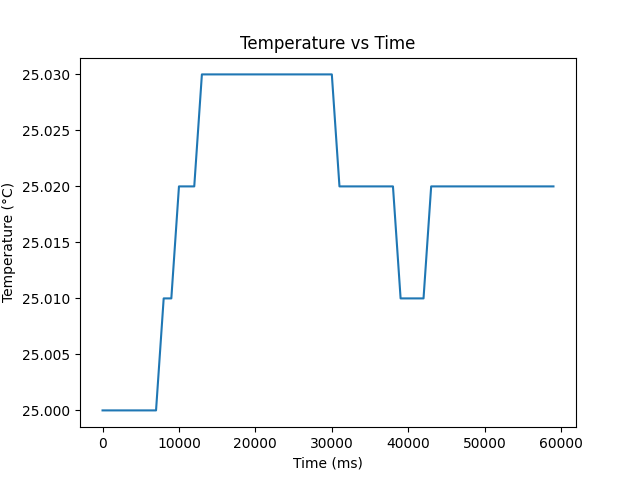
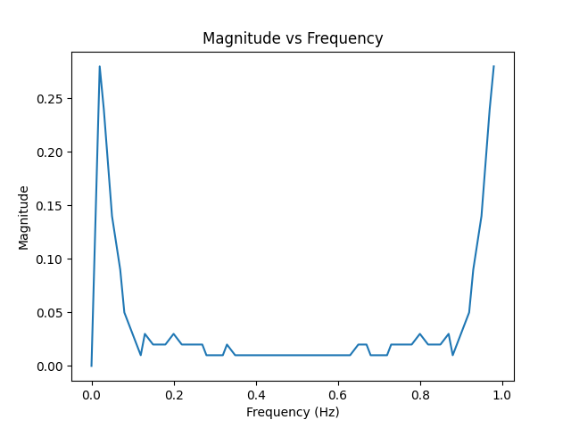
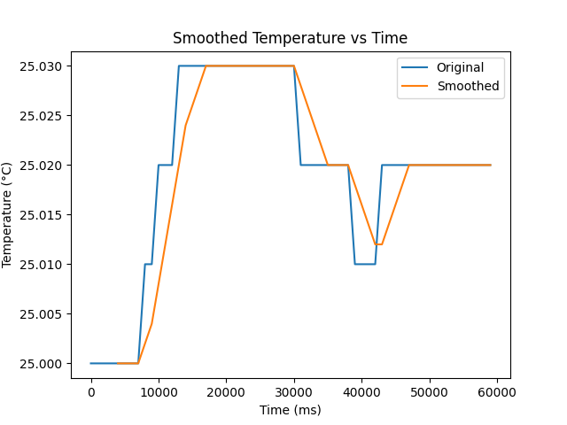
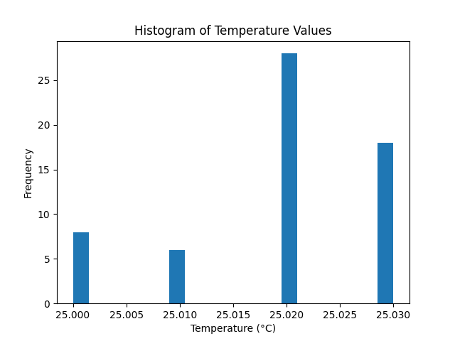
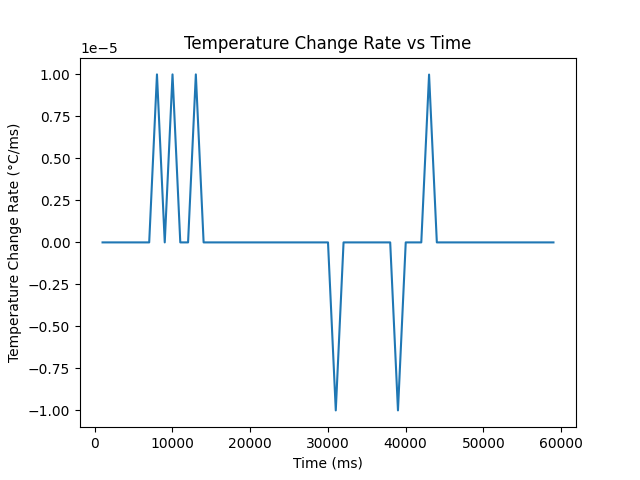

# Task 4 Analysis of Plots

### 1. Recorded Temperature Data vs time

The above plot shows the recorded temperature data over the data collection duration with the x-axis as time in miliseconds (ms) and temperature in celsius (C). In this plot, there is a clear steady increase after the 10000 ms mark where it maintains it's temperature till the 30000 second mark, going down to 25.010 C at around the 40000 ms mark, and stabilizing at 25.020 C around the 50000 ms mark.

### 2. Magnitude vs Frequency

The above plot was calculated using discrete fourier transform to identify the frequency and magnitude of temperature variation. This plot evidently shows 2 large spikes at both ends of the graph, consistent with graph 1 as the temperature varied the most at the beginning and at the end of the session, generating the 2 peaks above.

### 3. Smoothed Temperature vs Time

The above plot is a demonstration of smoothing using the rolling average like in my temperature optimization file, which as shown by the orange line streamlines the pattern to look like a more rounded slope compared to the jagged step increases of the blue line, additionally a bit of time lag can be seen from the smoothed data as it requires a rolling average (meaning prior data) to actually start calculating and plotting onto the graph.

### 4. Histogram of Temperature Readings

The above is a histogram representing the frequency of the most common temp readings. 25.020 C is the dominant value with a frequency of 25, which is in line with the temperature vs time data as 25.020 C was the temperature at which it stabilized before the data collection ended.

### 5. Rate of Change of Temperature vs Time

Above is a plot showing the rate of change of temperature over time, with familiar peaks similar to the temperature vs time graph.

# Analysis of Plots

## Time-domain behaviour
### Was the temperature stable over the 3 minutes?
Over time, the temperature flucuated beteween 25.030 and 25.010 C with peaks and dips throughout the collection duration.
### Were there any sudden rises or drops?
At the beginning, there was a major rise from 25.000 to 25.030 C and halfway through around after 30000 ms the temperature dropped to 25.010 only to stabilize again after 50000 ms. 
### Did the signal appear noisy?
The signal does appear noisy due to peaks and troughs throughout the data collection period
## Frequency-domain behaviour
### Which frequency component had the highest magnitude?
According to the plot, both 0.01 hz and about 1.0 hz had the highest magnitudes
### Was the signal mainly low-frequency?
A majority of it according to the plot was low frequency except for 2 peaks at both ends of the graph.
### Did the DFT reveal any repeated pattern or periodic fluctuation?
The DFT revealed that the dominant frequency components were around lower frequencies near 0hz, which meant that temperature changes were slow instead of having rapid flucuations, which is consistent with the data as it only changed around 0.01-0.03 C at max throughout the collection period.
### Was there evidence of noise in higher-frequency components?
In the magnitude frequency graph, there is a limited but still very present amount of noise close to the frequency peaks on the graph.
## System behaviour
### Did the adaptive sampling strategy behave as expected?
The adaptive sampling strategy was successful as after the collection period it determined to stay in ACTIVE mode, but when i wasn't drastically changing the temperature it immediately switched to power down mode saving memory and optimizing data collection.
### Did the power mode selection appear sensible?
I believe the power mode selection appeared sensible as the transition to power down I mentioned in the previous question came after a recording of a consistent stabilized temperature of 25 C with a magnitude of 0 for almost all the prior readings.
### Would you improve the system further?
If possible, I would try and encapsulate more of the global arrays to optimise memory usage, or if not possible on my end purchase a Arduino Mega with larger memory capacity to collect more samples in ACTIVE mode for the initial 3 minute data collection period.
## Data quality
### Was the recording duration sufficient?
Unfortunately due to the memory limitations of the Arduino Uno, I was only able to limit the arrays to max 60 samples allowing for at most a 1 minute data collection.
### Was the sampling rate appropriate?
Due to the ram limitations of the Arduino Uno, I had to unfortunately reduce the sampling array size to 60 to prevent memory overflow and memory corruption, as the program was already using 90% of memory just from building it. 
### Were there any limitations in your measurement method?
I had to utilize float arrays instead of doubles in order to conserve memory, so I was unable to create temperature data with even more precision than 3 d.p.